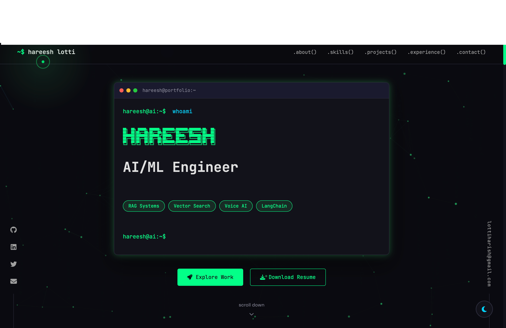

# 🚀 Hareesh Lotti - AI/ML Engineer Portfolio

A unique, cyberpunk-themed portfolio website featuring neural network animations, terminal-style interface, and cutting-edge interactive elements.



## ✨ Features

### 🎨 Visual Effects
- **Neural Network Background** - Animated particle system with mouse interaction
- **Matrix Rain Effect** - Subtle Japanese character rain in background
- **Custom Cursor** - Dot + ring cursor with hover effects
- **Cursor Glow** - Ambient glow that follows mouse
- **Glitch Effects** - Cyberpunk-inspired text animations
- **Neon Glow Effects** - Pulsing neon borders and shadows

### 🖥️ UI Components
- **Animated Preloader** - Brain/neural network loading animation
- **Terminal-Style Hero** - Command-line aesthetic with typing effect
- **ASCII Art Name** - Your name in cool text art
- **3D Card Hover** - Project cards tilt with perspective
- **Skill Progress Bars** - Animated when scrolled into view
- **Counter Animations** - Stats count up on scroll
- **Scroll Progress Bar** - Shows page scroll progress
- **Back to Top Button** - Smooth scroll to top
- **Theme Toggle** - Dark/Light mode switch

### 📊 Content Sections
- **GitHub Stats** - Live GitHub activity cards
- **Live Demos** - Showcase working projects
- **Value Proposition** - What you bring to teams
- **Availability Status** - Green dot showing you're open to work
- **Floating Social Links** - Fixed position social icons
- **Floating Email** - Vertical email on right side

### 🎮 Interactive Elements
- **Interactive Terminal** - Press `Ctrl+\`` for hidden command line!
- **Text Scramble** - Hover effect on special text
- **Magnetic Buttons** - Buttons that respond to cursor
- **Tooltip Hints** - Helpful hover tooltips
- **Console Easter Egg** - ASCII art in browser console

### 📱 Technical Features
- **Fully Responsive** - Mobile-first design
- **SEO Optimized** - Meta tags, Open Graph, Twitter Cards
- **Fast Loading** - Optimized assets, lazy loading
- **ATS-Friendly** - Clean HTML structure
- **No Dependencies** - Pure HTML/CSS/JS

## 🛠️ Tech Stack

- Pure HTML5, CSS3, JavaScript (ES6+)
- No frameworks - lightweight and blazing fast
- Custom animations (no external libraries)
- Works perfectly on GitHub Pages

## 📁 Project Structure

```
portfolio/
├── index.html          # Main HTML file
├── css/
│   ├── style.css       # Core styles
│   ├── animations.css  # Animation keyframes
│   └── enhanced.css    # Advanced features
├── js/
│   ├── main.js         # All functionality
│   └── particles.js    # Neural network canvas
├── assets/
│   └── images/         # Images and icons
└── README.md           # This file
```

## 🚀 Deployment to GitHub Pages

### Step 1: Create Repository

1. Go to GitHub and create a new repository named: `harish-lvrk.github.io`
2. Make sure it's **public**

### Step 2: Push Code

```bash
cd /Users/hareesh/zudu/portfolio

# Initialize git
git init

# Add all files
git add .

# Commit
git commit -m "Initial portfolio commit"

# Add remote (replace with your repo URL)
git remote add origin https://github.com/Harish-lvrk/harish-lvrk.github.io.git

# Push
git push -u origin main
```

### Step 3: Enable GitHub Pages

1. Go to repository **Settings**
2. Click **Pages** in the left sidebar
3. Under "Source", select **main** branch
4. Save

Your portfolio will be live at: `https://harish-lvrk.github.io`

## 🎨 Customization

### Colors
Edit CSS variables in `css/style.css`:

```css
:root {
    --primary: #00ff88;      /* Main accent color */
    --secondary: #00d4ff;    /* Secondary accent */
    --accent: #ff006e;       /* Highlight color */
    --bg-primary: #0a0a0f;   /* Background */
}
```

### Content
Update your information directly in `index.html`

### Adding Projects
Copy the project card template and update:

```html
<div class="project-card">
    <div class="project-header">
        <div class="project-icon">
            <i class="fas fa-icon-name"></i>
        </div>
        <div class="project-links">
            <a href="github-url" target="_blank" class="project-link">
                <i class="fab fa-github"></i>
            </a>
        </div>
    </div>
    <h3 class="project-title">Project Name</h3>
    <p class="project-description">Description...</p>
    <div class="project-tech">
        <span class="tech">Tech1</span>
        <span class="tech">Tech2</span>
    </div>
</div>
```

## 🎯 Easter Eggs

1. **Interactive Terminal**: Press `Ctrl+\`` to open a hidden terminal
   - Try commands: `help`, `whoami`, `skills`, `sudo hire`
2. **Console Message**: Open browser DevTools to see ASCII art
3. **Cursor Glow**: Mouse creates a subtle glow effect

## 📱 Browser Support

- Chrome (recommended)
- Firefox
- Safari
- Edge

## 📝 License

MIT License - Feel free to use and modify!

---

**Built with 💚 by Hareesh Lotti**

